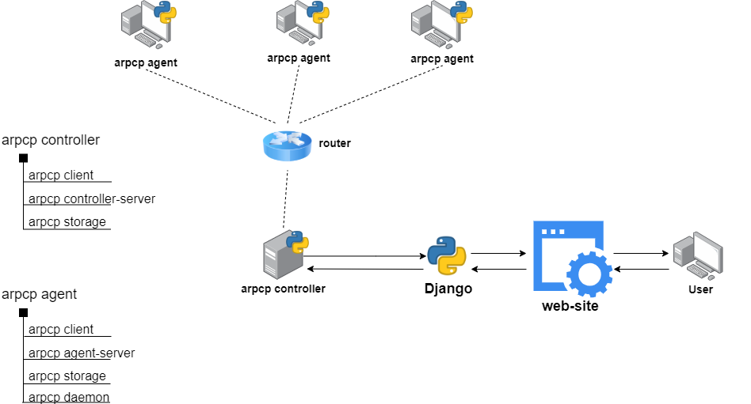

# Описание работы `arpcp cluster`'а

Имеется централизованная система из нескольких компьютеров, соединённых единой сетью, `arpcp cluster` (далее - `cluster`).

Все компьютеры `cluster`'а общаются по протоколу `arpcp`.

Для реализации протокола `arpcp` был выбран язык Python версии 3.7.

На центральном компьютере `cluster`'а, `arpcp controller`'е (далее - `controller`), устанавливается приложение `arpcp controller-app`. На остальных компьютерах, `arpcp agent`'ах (далее - `agent`), устанавливается приложение `arpcp agent-app`. 

`Contoller` периодически посылает `echo-request` для отслеживания статуса и поиска новых `agent`'ов.

`Contoller`'е может подключиться к `agent`'у и отправить запрос на выполнение задачи. При этом информация о задаче сохраняется и у `agent`'а, и у `controller`'а. После этого `agent` отправляет `controller`'у сообщение о том, что задача поставлена в очередь на выполнение, либо возвращает ошибку. Затем соединение разрывается.

После того, как `agent` выполнил задачу, он подключается к `controller`'у и передаёт результаты выполнения задачи.

Требования к `controller`:
- Python 3.7

Состав `controller-app`:
- `arpcp client`
- `arpcp controller-server`
- `arpcp controller-storage`
- `arpcp controller-daemon`

Требования к `agent`:
- Python 3.7

Состав `agent-app`:
- `arpcp client`
- `arpcp agent-server`
- `arpcp agent-storage`
- `arpcp agent-daemon`
